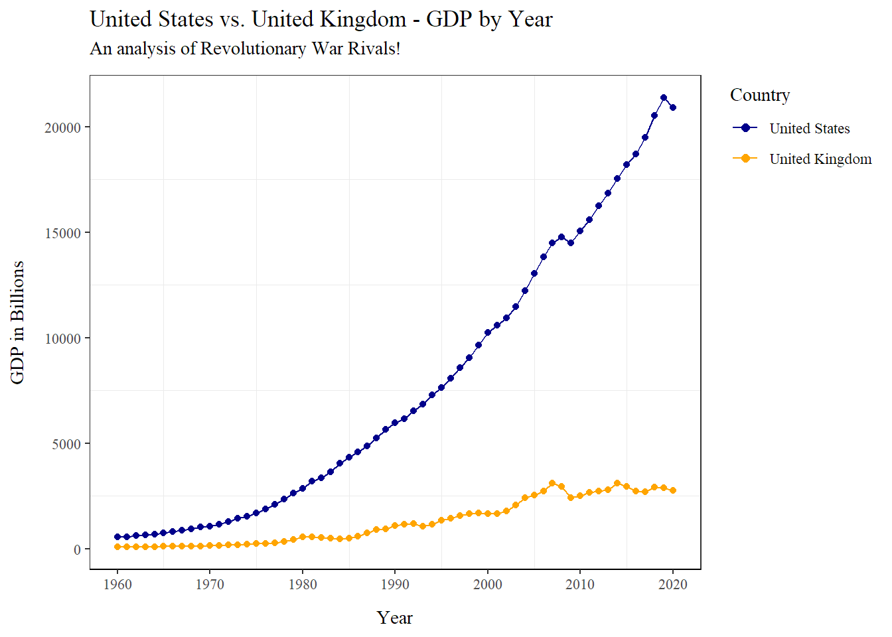
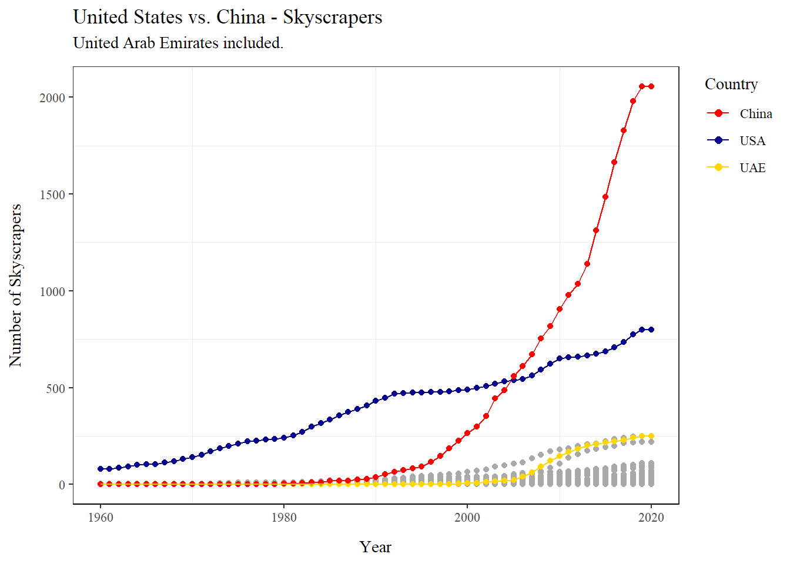
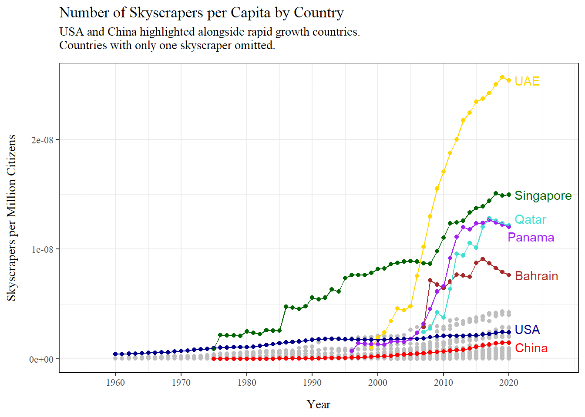
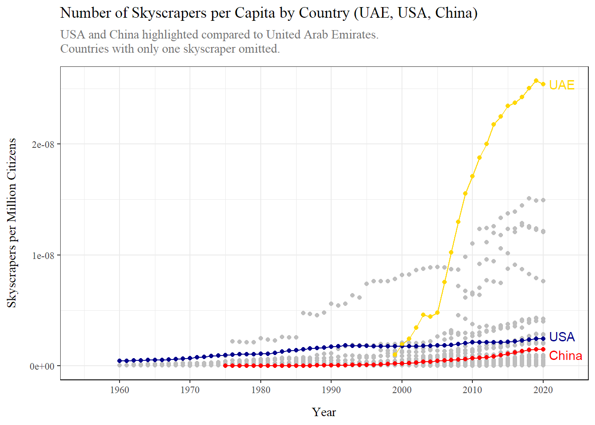

## Skyscraper Analysis

For this project I started with the question: "Which country has the most skyscrapers per person?" I then expanded the question to finding three values: 1) The country with the highest number of skyscrapers, 2) the country with the most skyscrapers per person, and 3) the country with the most skyscrapers in relation to GDP.


## Creating Datasets:


::: {.cell}

```{.r .cell-code}
# Code downloading and wrangling GDP data since 1960:
# GDP is in Billions.
gdp_1960 <- read.csv("C:\\Users\\theka\\Desktop\\Projects\\Website_project\\Datasets\\GDP DATA.csv", sep = ",") %>% 
  rename("country_name" = Country_Name) %>% 
  select(-c(Country_Code, Indicator_Code, Indicator_Name)) %>% 
  pivot_longer(!country_name, names_to = "year", values_to = "GDP2") %>% 
  mutate("country_name2" = case_when(
    country_name == "Iran, Islamic Rep." ~ "Iran",
    country_name == "Korea, Rep." ~ "Korea",
    country_name == "Russian Federation" ~ "Russia",
    country_name == "Turkiye" ~ "Turkey",
    country_name == "Venezuela, RB" ~ "Venezuela",
    TRUE ~ country_name
  )) %>% 
  select(-country_name) %>% 
  mutate("GDP" = GDP2/1000000000) %>% 
  mutate("ID" = paste(country_name2, year, sep = ".")) %>% 
  rename("country_name" = country_name2)

# Code downloading and wrangling popoulation data since 1960:
# Population is in Millions.
pop_1960 <- read.csv("C:\\Users\\theka\\Desktop\\Projects\\Website_project\\Datasets\\World Population by Country.csv") %>% 
  rename("country_name" = Country.Name) %>% 
  select(-c(Indicator.Name, Country.Code, Indicator.Code)) %>% 
  pivot_longer(!country_name, names_to = "year", values_to = "POP2") %>% 
  mutate("country_name2" = case_when(
    country_name == "Korea, Rep." ~ "Korea",
    country_name == "Russian Federation" ~ "Russia",
    country_name == "Venezuela, RB" ~ "Venezuela",
    country_name == "Iran, Islamic Rep." ~ "Iran",
    TRUE ~ country_name
  )) %>% 
  select(-country_name) %>% 
  mutate("ID" = paste(country_name2, year, sep = "."))%>% 
  mutate("POP" = POP2/1000000) %>%
  rename("country_name" = country_name2)

# Code downloading and wrangling country skyscraper data since 1960:
skyscraper_1960 <- read.csv("C:\\Users\\theka\\Desktop\\Projects\\Website_project\\Datasets\\Total Skyscraper by Country.csv") %>% 
  rename("country_name" = Country) %>% 
  select(-c(url)) %>% 
  pivot_longer(!c(country_name, Religion), names_to = "year", values_to = "Skyscraper") %>% 
  mutate("country_name2" = case_when(
    country_name == "Canad" ~ "Canada",
    country_name == "Qutar" ~ "Qatar",
    country_name == "SIngapore" ~ "Singapore",
    country_name == "Viet Nam" ~ "Vietnam",
    TRUE ~ country_name
  )) %>% 
  select(-country_name) %>% 
  mutate("ID" = paste(country_name2, year, sep = ".")) %>% 
  filter(country_name2 != "North Korea") %>% 
  rename("country_name" = country_name2)

data_merge <- skyscraper_1960 %>% 
  left_join(gdp_1960, by = "ID") %>% 
  left_join(pop_1960, by = "ID") %>% 
  select(country_name, ID, GDP, POP, Skyscraper) %>% 
  mutate("year" = as.integer(str_sub(ID, start = -4)))
```
:::


## Data Demonstration:


::: {.cell}

```{.r .cell-code}
# Analysis to visualize USA GDP vs. UK GDP:
USA_analysis <- data_merge %>% 
  filter(country_name %in% c("United Kingdom", "United States"))

# Visualization to show differece between USA GDP and UK GDP:
ggplot(data = USA_analysis) +
  geom_point(mapping = aes(x = year, y = GDP, color = factor(country_name, levels = c("United States", "United Kingdom")))) +
  geom_line(mapping = aes(x = year, y = GDP, color = factor(country_name, levels = c("United States", "United Kingdom")))) +
  scale_x_continuous(breaks = seq(1960, 2020, 10)) +
  scale_color_manual(values = c("United States" = "darkblue", "United Kingdom" = "orange")) +
  labs(x = "Year", 
       y = "GDP in Billions",
       color = "Country",
       title = "United States vs. United Kingdom - GDP by Year",
       subtitle = "An analysis of Revolutionary War Rivals!") +
  theme_bw() +
  theme(axis.line.x = element_line(),
        legend.justification = "top",
        panel.grid.major.x = element_blank(),
        panel.grid.major.y = element_blank(),
        axis.title.y = element_text(margin = margin(t = 0, r = 10, b = 0, l = 0)),
        axis.title.x = element_text(margin = margin(t = 10, r = 0, b = 0, l = 0)),
        plot.subtitle = element_text(margin = margin(t = 0, r = 0, b = 10, l = 0)),
        text = element_text(family = "serif"),
        plot.caption = element_text(hjust = 0)) +
  guides(color = guide_legend(override.aes = list(size = 2)))
```

::: {.cell-output-display}
{width=672}
:::
:::


This plot showcases one of the features of my created data set: GDP by country per year. This plot showcases the difference in GDP of the United States from the United Kingdom from the year 1960 to 2020. In the plot you can see a few important things, the United States has gained a massive lead over the United Kingdom, which is surprising seeing they started at a relatively close GDP in 1960. You can also see two semi-prominent dips in the GDP's of both countries occurring in 2008 and 2019. This is due to the housing market collapse of 2008 and the COVID-19 pandemic which started in 2019.

## Skyscrapers in General:


::: {.cell}

```{.r .cell-code}
# Code determining labels for the top three countries:
highest_skyscraper <- data_merge %>% 
  filter(country_name %in% c("China", "United States", "United Arab Emirates")) %>%
  mutate("new_country_name" = case_when(
    country_name == "United States" ~ "USA",
    country_name == "United Arab Emirates" ~ "UAE",
    TRUE ~ country_name
  ))

# Visualization: Top three countries vs. The rest of the world
ggplot(data = data_merge) +
  geom_point(mapping = aes(x = year, y = Skyscraper), color = "darkgrey") +
  geom_point(data = highest_skyscraper, mapping = aes(x = year, y = Skyscraper, color = factor(new_country_name, levels = c("China", "USA", "UAE")))) +
  geom_line(data = highest_skyscraper, mapping = aes(x = year, y = Skyscraper, color = factor(new_country_name, levels = c("China", "USA", "UAE")))) +
  scale_color_manual(values = c("China" = "red", "USA" = "darkblue", "UAE" = "gold")) +
  labs(x = "Year",
       y = "Number of Skyscrapers",
       color = "Country",
       title = "United States vs. China - Skyscrapers",
       subtitle = "United Arab Emirates included.") +
  theme_bw() +
  theme(axis.line.x = element_line(),
        legend.justification = "top",
        panel.grid.major.x = element_blank(),
        panel.grid.major.y = element_blank(),
        axis.title.y = element_text(margin = margin(t = 0, r = 10, b = 0, l = 0)),
        axis.title.x = element_text(margin = margin(t = 10, r = 0, b = 0, l = 0)),
        plot.subtitle = element_text(margin = margin(t = 0, r = 0, b = 10, l = 0)),
        text = element_text(family = "serif"),
        plot.caption = element_text(hjust = 0)) +
  guides(color = guide_legend(override.aes = list(size = 2)))
```

::: {.cell-output-display}
{width=672}
:::
:::


This plot displays number of skyscrapers by country. From this visualization I found two interesting countries: [The United States (highlighted in blue) and China (highlighted in red)]{.underline}. The USA has been building skyscrapers at a consistent rate for the past 60 years, and it maintained the the status as the country with the most skyscrapers for 45 years. However, around 2005 it was overtaken (and QUICKLY) by China. China went from having almost no skyscrapers to having the most skyscrapers in a span of only 20 years. This growth is unprecedented.

Highlighted in Gold you will see the United Arab Emirates. Note their construction of hundreds of skyscrapers since the early 2000's, quickly moving them from the bottom of the pack to having the third most skyscrapers in the world! Keep your eye on them, as the United Arab Emirates will play a major part of the following visualizations. In fact, this jump can be illustrated by this table:


::: {.cell}

```{.r .cell-code}
# table to find top three countries in 1960:
table1 <- data_merge %>% 
  filter(year == 1960) %>% 
  mutate("rank" = rank(-Skyscraper, ties = "first")) %>% 
  top_n(3, -rank) %>% 
  arrange(rank) %>% 
  pivot_wider(names_from = year, values_from = Skyscraper) %>% 
  select(country_name, "1960", rank) %>% 
  rename("1960 Countries" = country_name)

# table to find top three countries in 2020:
table2 <-data_merge %>% 
  filter(year == 2020) %>% 
  mutate("rank" = rank(-Skyscraper, ties = "first")) %>% 
  top_n(3, -rank) %>% 
  arrange(rank) %>% 
  pivot_wider(names_from = year, values_from = Skyscraper) %>% 
  select(country_name, "2020", rank) %>% 
  rename("2020 Countries" = country_name)

# table to show top three countries for skyscrapers in 1960 vs. 2020:
visual <- table1 %>% 
  inner_join(table2, by = "rank") %>% 
  select("rank", "1960 Countries", "1960", "2020 Countries", "2020")

head(visual)
```

::: {.cell-output .cell-output-stdout}
```
# A tibble: 3 × 5
   rank `1960 Countries` `1960` `2020 Countries`     `2020`
  <int> <chr>             <int> <chr>                 <int>
1     1 United States        79 China                  2055
2     2 Russia                5 United States           800
3     3 Brazil                1 United Arab Emirates    251
```
:::
:::


This table shows the change in skyscraper dominant countries from 1960 to 2020. The United States went from being number one in the world to being a distant second. China went from not even having a skyscraper in 1960 to being number one in the world! And the United Arab Emirates has risen above the rest of the world be a strong third place.

## Skyscrapers per Capita:


::: {.cell}

```{.r .cell-code}
# Filtering out countries with only one skyscraper to keep data consistent:
data_per_cap <- data_merge %>% 
  mutate("per_capita" = Skyscraper / (POP * 1000000000)) %>% 
  filter(Skyscraper > 1)

# Creating a table to color the top countries:
highest_per_cap <- data_per_cap %>%  
  filter(country_name %in% c("United Arab Emirates", "Qatar", "Bahrain", "Panama", "Singapore", "United States", "China"))

# Creating a table to create colored labels for the top countries:
percap_labels <- data_per_cap %>% 
  filter(year == 2020) %>% 
  filter(country_name %in% c("United Arab Emirates", "Qatar", "Bahrain", "Panama", "Singapore", "United States", "China")) %>% 
  mutate("new_country_name" = case_when(
    country_name == "United Arab Emirates" ~ "UAE",
    country_name == "United States" ~ "USA",
    TRUE ~ country_name
  ))

# Creating a visualization to show the top countries in relation to the world:
ggplot(data = data_per_cap) +
  geom_point(mapping = aes(x = year, y = per_capita), color = "grey") +
  geom_point(data = highest_per_cap, mapping = aes(x = year, y = per_capita, color = country_name)) +
  geom_line(data = highest_per_cap, mapping = aes(x = year, y = per_capita, color = country_name)) +
  geom_text_repel(data = percap_labels, mapping = aes(x = year, y = per_capita, label = new_country_name, color = country_name), nudge_x = 2.5) +
  
  scale_x_continuous(breaks = seq(1960, 2020, 10), limits = c(1955, 2027)) +
  scale_color_manual(values = c("United States" = "darkblue", "China" = "red", "United Arab Emirates" = "gold", "Singapore" = "darkgreen", "Qatar" = "turquoise", "Panama" = "purple", "Bahrain" = "brown")) +
  
  labs(x = "Year",
       y = "Skyscrapers per Million Citizens",
       title = "Number of Skyscrapers per Capita by Country",
       subtitle = "USA and China highlighted alongside rapid growth countries.
Countries with only one skyscraper omitted.") +
  
  theme_bw() +
  theme(axis.line.x = element_line(),
        axis.title.y = element_text(margin = margin(t = 0, r = 10, b = 0, l = 0)),
        axis.title.x = element_text(margin = margin(t = 10, r = 0, b = 0, l = 0)),
        plot.subtitle = element_text(margin = margin(t = 0, r = 0, b = 10, l = 0)),
        legend.position = "none",
        text = element_text(family = "serif"),
        plot.caption = element_text(hjust = 0)) +
  guides(color = guide_legend(override.aes = list(size = 2)))
```

::: {.cell-output-display}
{width=672}
:::
:::


*(I have decided to omit countries with only one skyscraper and small populations as they seemed to skew the data).*

Here you can see a plot of the top five countries with the most skyscrapers per million citizens along with the USA and China. In this plot it is clear that while China may have more skyscrapers than the United States, the United States has more skyscrapers per person. Yet, the United States does not have the most skyscrapers per person. Plotted in color above the United States and China you will find five highlighted countries with the most skyscrapers per person.

The most notable in this group is the United Arab Emirates (I told you to keep an eye on them!). Although they are third place in terms of skyscrapers generally, they have the most skyscrapers per person in the world! To make this point more clear I have created the following visualization showing just the top three countries in terms of skyscrapers in general:


::: {.cell}

```{.r .cell-code}
# table to filter down to just the top three countries for skyscrapers:
uae_analysis <- data_per_cap %>%  
  filter(country_name %in% c("United Arab Emirates", "United States", "China"))

# table to create labels for the top three countries:
labels_uae_analysis <- data_per_cap %>% 
  filter(year == 2020) %>% 
  filter(country_name %in% c("United Arab Emirates", "United States", "China")) %>%
  mutate("new_country_name" = case_when(
    country_name == "United Arab Emirates" ~ "UAE",
    country_name == "United States" ~ "USA",
    TRUE ~ country_name
  ))

# Visualization to show the top three countries relative to the world:
ggplot(data = data_per_cap) +
  geom_point(mapping = aes(x = year, y = per_capita), color = "grey") +
  geom_point(data = uae_analysis, mapping = aes(x = year, y = per_capita, color = country_name)) +
  geom_line(data = uae_analysis, mapping = aes(x = year, y = per_capita, color = country_name)) +
  geom_text_repel(data = labels_uae_analysis, mapping = aes(x = year, y = per_capita, label = new_country_name, color = country_name), nudge_x = 2.5) +
  
  scale_x_continuous(breaks = seq(1960, 2020, 10), limits = c(1955, 2023)) +
  scale_color_manual(values = c("United Arab Emirates" = "gold", "United States" = "darkblue", "China" = "red")) +
  
  labs(x = "Year",
       y = "Skyscrapers per Million Citizens",
       title = "Number of Skyscrapers per Capita by Country (UAE, USA, China)",
       subtitle = "USA and China highlighted compared to United Arab Emirates.
Countries with only one skyscraper omitted.") +
  
  theme_bw() +
  theme(axis.line.x = element_line(),
        axis.title.y = element_text(margin = margin(t = 0, r = 10, b = 0, l = 0)),
        axis.title.x = element_text(margin = margin(t = 10, r = 0, b = 0, l = 0)),
        plot.subtitle = element_text(margin = margin(t = 2, r = 0, b = 10, l = 0), color = "grey45"),
        legend.position = "none",
        text = element_text(family = "serif"),
        plot.caption = element_text(hjust = 0)) +
  guides(color = guide_legend(override.aes = list(size = 2)))
```

::: {.cell-output-display}
{width=672}
:::
:::


Compare this visualization to the first under Skyscrapers in General. The difference is staggering! In the former you can see the United States and China far exceed every other country, while the latter shows they are sitting around the values for the rest of the world. In this plot the United Arab Emirates completely outshines other countries. Their value skyrockets as they are building more skyscrapers per person than any other country in the world.

The other interesting point I find in this plot is the fact that the United States is still higher than China in terms of skyscrapers per person. While it is amazing that they constructed 2,000 in a little over 20 years, they have far more people than the United States. This shows they are most likely building these skyscrapers to accommodate residents, while the immense growth of the United Arab Emirates in this plot most likely means they are building skyscrapers as a show of wealth.

## Skyscrapers in relation to GDP:

For this section I decided to create a whole new statistic (at least one that I haven't heard of before!). By taking the GDP and dividing it by the population I find the GDP per person. I then multiply the GDP per person by the number of skyscrapers in the country to find what I call the "Empire stat", named after the Empire State Building.

I felt this stat would best show the number of skyscrapers relative to GDP as dividing the number of skyscrapers by the GDP would cause countries with low skyscrapers and low GDP's to be ranked higher than countries with moderate skyscrapers and high GDP's.


::: {.cell}

```{.r .cell-code}
# Table to show the empire stat per country:
sky_gdp <- data_merge %>% 
  mutate("gdp_capita" = GDP / POP) %>% 
  mutate("empire" = gdp_capita * Skyscraper)

# Table to plot the top five countries:
top_gdp <- sky_gdp %>% 
  filter(country_name %in% c("United States", "China", "Japan", "United Arab Emirates", "Korea")) %>% 
  arrange(desc(empire)) %>% 
  mutate("new_country_name" = case_when(
    country_name == "United Arab Emirates" ~ "UAE",
    country_name == "United States" ~ "USA",
    TRUE ~ country_name
  ))

# Table to create labels for the highest countries:
labels_gdp <- sky_gdp %>% 
  filter(year == 2020) %>% 
  filter(country_name %in% c("United States", "China", "United Arab Emirates", "Korea")) %>% 
  arrange(desc(empire)) %>% 
  mutate("new_country_name" = case_when(
    country_name == "United Arab Emirates" ~ "UAE",
    country_name == "United States" ~ "USA",
    TRUE ~ country_name
  ))

# Table to make Japan's label separate to make sure they don't overlap:
japan_labels_gdp <- sky_gdp %>% 
  filter(year == 2020) %>% 
  filter(country_name %in% c("Japan"))
```
:::

::: {.cell}

```{.r .cell-code}
# 
ggplot(data = sky_gdp) +
  geom_point(mapping = aes(x = year, y = empire), color = "grey") +
  geom_point(data = top_gdp, mapping = aes(x = year, y = empire, color = country_name)) +
  geom_line(data = top_gdp, mapping = aes(x = year, y = empire, color = new_country_name)) +
  geom_text(data = labels_gdp, mapping = aes(x = year, y = empire, label = new_country_name, color = country_name), position = position_nudge(x = 4)) +
  geom_text(data = japan_labels_gdp, mapping = aes(x = year, y = empire, label = country_name, color = country_name), position = position_nudge(x = 4, y = 2250)) +
  theme(legend.position = "none") +

  scale_x_continuous(breaks = seq(1960, 2020, 10), limits = c(1955, 2025)) +
  scale_color_manual(values = c("United Arab Emirates" = "gold", "UAE" = "gold", "United States" = "darkblue", "USA" = "darkblue", "Japan" = "darkgreen", "Korea" = "purple3", "China" = "red")) +
  
  labs(x = "Year",
       y = "Skyscrapers per Million Citizens",
       title = "Number of Skyscrapers per Capita by Country",
       subtitle = "USA and China highlighted alongside rapid growth countries.
Countries with only one skyscraper removed.") +
  
  theme_bw() +
  theme(axis.line.x = element_line(),
        axis.title.y = element_text(margin = margin(t = 0, r = 10, b = 0, l = 0)),
        axis.title.x = element_text(margin = margin(t = 10, r = 0, b = 0, l = 0)),
        plot.subtitle = element_text(margin = margin(t = 0, r = 0, b = 10, l = 0)),
        legend.position = "none",
        text = element_text(family = "serif"),
        plot.caption = element_text(hjust = 0)) +
  guides(color = guide_legend(override.aes = list(size = 2)))
```

::: {.cell-output .cell-output-stderr}
```
Warning: Removed 416 rows containing missing values (`geom_point()`).
```
:::

::: {.cell-output .cell-output-stderr}
```
Warning: Removed 15 rows containing missing values (`geom_point()`).
```
:::

::: {.cell-output .cell-output-stderr}
```
Warning: Removed 15 rows containing missing values (`geom_line()`).
```
:::

::: {.cell-output-display}
{width=672}
:::
:::


This plot shows the United States maintains dominance in the empire stat. While China has constructed more skyscrapers than the United States, the large GDP of the US gives it an edge in this fight. Another interesting point is that Japan has edged out the United Arab Emirates to take third place in the empire stat! This is most likely due to Japan having a higher GDP than the United Arab Emirates although it has fewer skyscrapers overall.

## Summary:

The United States was the dominant skyscraper country through the whole of the 1900's, but since the turn of the century China has taken over that mantle. However, when adjusting for population the United States still maintains a lead over China as they have a much larger population than the United States.

However, the United States is still far from dominant when adjusting for population. The United Arab Emirates has drastically increases their building of skyscrapers since the early 2000's, jumping from 6 skyscrapers at the turn of the century to 251 in 2020! This, combined with their small population has cemented them as the country with the most skyscrapers per person in the world!

However, when adjusting the number of skyscrapers by GDP per person (a stat I have called the empire stat), you see the United States maintains a commanding lead over the rest of the world. This is due to the United States GDP being nearly 1.5x China's, and 50x higher than the United Arab Emirates.

Overall, the United States is not the dominant force it used to be in relation to skyscrapers, but remains a dominant force in economic terms.
